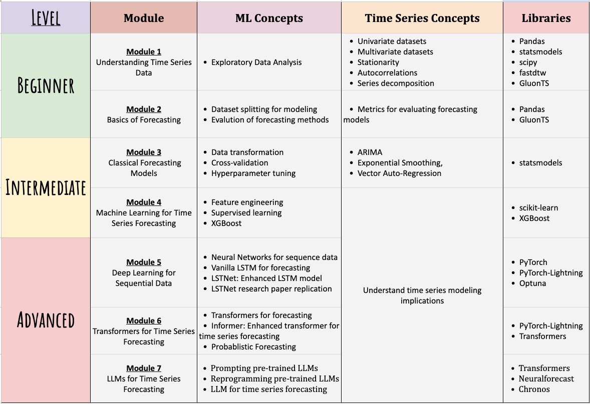
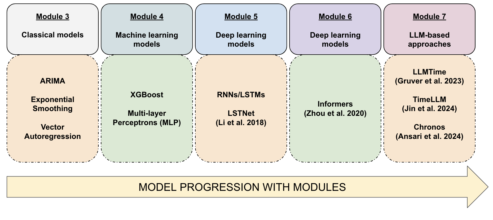
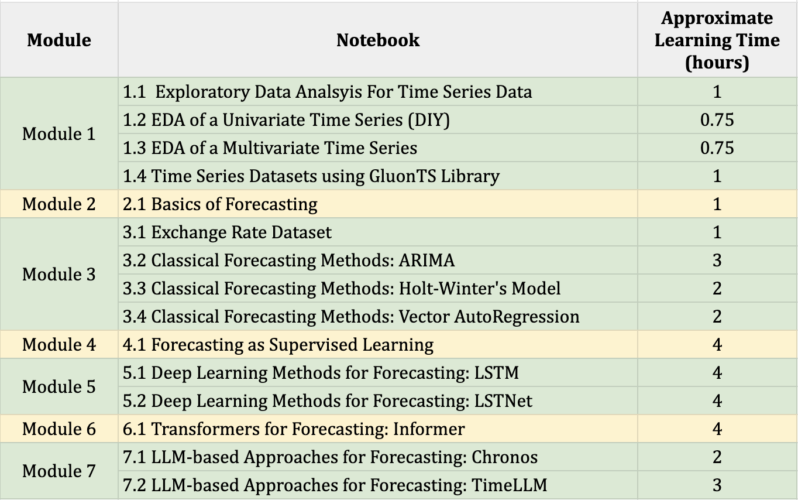

# Time Series Forecasting: Classical to Advanced Modeling Techniques & Tools

<!-- <b>Author:</b> <a href="www.pgupta.info" target="blank">Prateek Gupta</a> -->
<b>Author:</b> <a href="www.pgupta.info" target="blank">Prateek Gupta (www.pgupta.info)</a>
<b>Created:</b> September, 2024

---

Time series data is ubiquitous across various real-world scenarios, such as traffic flow, weather patterns, and economic indicators. 
Multiple methods have been developed, addressing tasks such as:

- **Forecasting:** Predict future events based on historical time series data.
- **Anomaly Detection:** Spot unusual patterns that deviate from expected behavior.
- **Clustering:** Categorize similar time series.
- **Classification:** Assign time series data to predefined classes.
- **Segmentation:** Break down a time series into meaningful segments.
- **Change Point Detection:** Determine points at which the statistical properties of the series shift significantly.
- **Causality Analysis:** Use techniques like Granger causality to discover relationships between different time series.
- **Dimensionality Reduction:** Apply methods such as Dynamic Time Warping (DTW) to reduce the complexity of time series data.

--- 

    
 What is this series about? 

This tutorial series aims to bring together **software libraries and modeling techniques for time series forecasting**. We will use Python libraries to build an understanding of time series forecasting problems, the challenges involved, and various forecasting techniques through hands-on python notebooks.

**What to Expect (and Not Expect) at the End?**
This tutorial is designed to introduce you to both the research literature and the open-source community surrounding time series forecasting techniques. You'll gain familiarity with a wide range of approaches, from classical methods to advanced LLM-based models. However, if you have a specific dataset, additional exploration may be required. Completing this tutorial will not guarantee a solution for your unique time series problem, but you will develop enough intuition and understanding to navigate online resources effectively.

**What is not covered?**
Each module is focused on exposing you to a specific class of techniques, such as transformer-based architectures or LLM-based approaches. However, it is not feasible to exhaustively cover all methods within these categories. The goal is not exhaustive coverage but rather to provide you with the foundational understanding needed to explore the space on your own.
 
 --- 

    
Who is this series for?

This tutorial is tailored for a specific audience with one or more of the following characteristics:

- **Comfort with Python**: You should either be comfortable using Python or ready to learn it by doing. It's a plus, if you can refer to Python documentation for relevant libraries, enhancing your understanding as needed.

- **Basic mathematical understanding**: You should be able to follow basic mathematical notations, as they will be used to explain concepts throughout the tutorial.

- **Foundational knowledge of machine learning pipelines**: While I'll explain the rationale behind the models, it will be easier to follow along if you have a basic understanding of machine learning workflows. For unfamiliar concepts, you can refer to online resources for deeper insights.

- **Curiosity-Driven learning**: You want to explore time-series forecasting through practical, hands-on experience. 

- **Reconnecting with time series**: You studied the basics of time series analysis a while ago but want to catch up on recent developments and trends in the field.

- **Independent learner**: Since not every question can be anticipated, it's assumed that you’re willing to look up answers and resources online to supplement your learning.

- **Eager to contribute to the community**: If you're interested in contributing to research or developing software tools, this tutorial will help you understand the current state of the field and guide you on how to navigate the research community.

--- 

    
What to expect in this series?

This series consists of 7 modules that gradually build a holistic understanding of forecasting, as well as the ability to build models oneself. Each module is taught through notebooks that include both discussions and executable code, allowing for hands-on learning. The modules and concepts covered are best described in the table below.

</img>

---

    
How are the models for the tutorial selected?

The models explored in these notebooks are not necessarily the best ones for the dataset at hand. They are chosen for their simplicity, making it easier to introduce the broader family of respective models, libraries, and basic concepts to the audience. The purpose of the exercise is to familiarize ourselves with the tools, techniques, and concepts used in time series forecasting. Each notebook contains exercises to extend the modeling techniques in various directions if you want to push the limits of the models.

</img>

**References**

[(Lai et al., 2018) Modeling Long- and Short-Term Temporal Patterns with Deep Neural Networks](https://arxiv.org/abs/1703.07015)

[(Zhou et al., 2020) Informer: Beyond Efficient Transformer for Long Sequence Time-Series Forecasting](https://arxiv.org/abs/2012.07436)

[(Gruver et al., 2023) Large Language Models Are Zero-Shot Time Series Forecasters](https://arxiv.org/pdf/2310.07820)

[(Jin et al., 2024) Time-LLM: Time Series Forecasting by Reprogramming Large Language Models](https://arxiv.org/abs/2310.01728)

[(Ansari et al., 2024) Chronos: Learning the Language of Time Series](https://arxiv.org/abs/2403.07815)

--- 

    
How are the libraries for the tutorial selected?

The main criterion for choosing the libraries in this tutorial is their suitability for time series forecasting and the availability of larger community support. However, this is not always possible. As of September 2024, `GluonTS`, `neuralforecast`, and `Chronos` are still undergoing significant development, and their interfaces might change or stop being supported by the developers altogether. Therefore, it is important to ensure that particular versions of these libraries are installed.

--- 

    
What is the dataset used for learning in these tutorials?

Throughout these tutorials, we will stick to a single multivariate dataset containing weekly exchange rate data for 8 countries. 

- The dataset has been chosen to ensure that the number of observations is manageable, making it easier to train the models.
- The dataset is multivariate to present a more general case, rather than focusing solely on a univariate example.
- Using a single dataset across all notebooks makes it easier to compare the performance of different modeling techniques. It's important to note that an advanced model will not necessarily outperform simpler models on every dataset. Performance depends heavily on the specific dataset and how it is preprocessed.

---

    
How to navigate the modules?

Modules 1 and 2 cover the basics of time series forecasting. Specifically, Module 1/Notebook 1.4 introduces GluonTS, which will be used later in Module 6.

If you'd prefer to skip the exploratory data analysis (EDA) aspects of time series, you can start from Module 3/Notebook 3.1, which focuses on data and problem formulation. This foundation will be used for building models in the subsequent modules.

Once you have completed Module 3/Notebook 3.1, feel free to jump to any other module or notebook focused on model building, as there are no strict dependencies between them.

---

    
How much time will it take to cover these notebooks?

This depends on your background and the notebooks that you would like to cover. Here is an approximate time that you might take in each notebook, although you can take less or more depending on how you are intereacting with the notebooks.

</img>

---

    
How to navigate the notebooks?

Each notebook focuses on a unique aspect of time series forecasting. However, some notebooks can be quite long, and without easy navigation, it can be challenging to keep track of the content. JupyterLab and VSCode both offer an "Outline" view, which allows you to see the structure of the notebook and easily navigate between sections.

From **Module 3/Notebook 3.2** onwards, each notebook is dedicated to a model-building exercise. Each notebook follows a similar structure after the model is trained, with the following sections:
- **Forecast**: Where the trained model is used to forecast future steps.
- **Evaluate**: Where the forecasts are evaluated against the true underlying values.
- **Compare Models**: Comparing the performance of the model against others.
- **Plot Forecasts**: Visualizing the forecasts from different models.
- **Conclusions**: Summarizing the key takeaways.
- **Exercises**: Suggestions for extending the modeling exercises on your own.
- **Next Steps**: Guidance on which other notebooks to explore next.

---

    
How to setup the environment?

Please refer to instructions in `installation.md`

---

    
How can I improve this tutorial?

- If you notice any errors that you'd like me to correct, please feel free to email me at [contact@pgupta.info](mailto:contact@pgupta.info).

- Once you have gone through the tutorial, I’d love your feedback! Your input will help me improve the tutorials and create a better learning experience for everyone. The survey is short and should only take 2-5 minutes to complete, covering topics like your overall experience, content clarity, and areas for improvement. 

    Suvery link to access it in a separate browser: [https://forms.gle/Dhtpbb8VfQhneWh49](https://forms.gle/Dhtpbb8VfQhneWh49)

    You can also fill it here using the form below: 

<iframe src="https://docs.google.com/forms/d/e/1FAIpQLSc0VhoX_Y9OeNdqZZ88kvHsleH829n_QYlCphuiMr87GiaJUQ/viewform?embedded=true" width="640" height="700" frameborder="0" marginheight="0" marginwidth="0">Loading…</iframe>

---